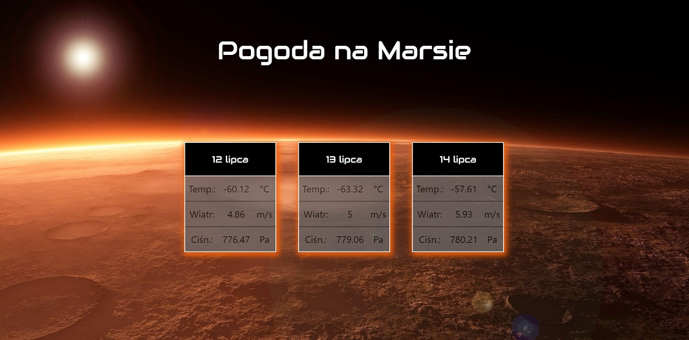

# Mars Weather
## Table of contents
* [General info](#general-info)
* [Overview](#overwiev)
* [Technologies](#technologies)
* [Setup](#setup)
* [Attention](#attention)

## General info
This simply app allows checking weather on Mars during the latest days. It was my first adventure with React.

## Overview
Just click the button "Zobacz"


and get to know about weather on the Red Planet



## Technologies
Project is created with:
* React
* HTML
* CSS

## Setup
To run this project, you'll need Node.js (which comes with npm) installed on your computer. 
```
$ cd ../check-weather-on-Mars
$ npm install
$ npm start
```
## Attention
Unfortunately weather sensors aboard NASA's InSight Mars lander stopped providing data on Sunday, Aug. 16, 2020, a result of an issue affecting the sensor suite's electronics so my app doesn't work :/
